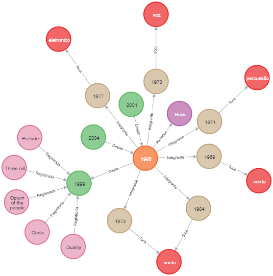

## Aluno: Arthur Monteiro Tibolla
---
### RA: 1125401

A banda escolhida para o trabalho foi a famosa banda de death metal **Slipknot**, uma das minhas bandas favoritas, por isso as imagens svg e png serão apenas dos grafos do Slipknot, porém ao longo do trabalho algumas formas de criação de nodos e relacionamentos foram usados para aprendizado. Primeiramente pensei em adicionar várias bandas no grafo, porém resolvi fazer apenas uma que usasse todos os nodos e arestas necessários para o trabalho. tanto nodos como relacionamentos foram criados de formas diferentes.

### Grafo já criado



## Criando o gênero
```
CREATE (Rock:Genero {nome:'Rock'})
```

## Criando a banda
```
CREATE (Slipknot:Banda {nome:'Slipknot', fundacao:'1995', subgenero:'death metal'})
```
## Relacionando banda ao genero
```
MATCH (b1:Banda {nome:"Slipknot"}), (g1:Genero {nome:"Rock"})
CREATE (b1)<-[:Pertence]-(g1)
```

## Também é possível criar um relacionamento da seguinte forma
```
CREATE (Polyphia:Banda {nome:'Polyphia', fundacao:'2010',subgenero:'progressivo'})-[:Pertence]->(Rock:Genero {nome:'Rock'})
```

## Criando os instrumentos
```
CREATE (Guitarra:Instrumento {nome:'guitarra' , tipo:'corda'})
CREATE (Mixer:Instrumento {nome:'mixer' , tipo:'eletronico'})
CREATE (Bateria:Instrumento {nome:'bateria' , tipo:'percussão'})
CREATE (Vocal:Instrumento {nome:'vocal' , tipo:'voz'})
CREATE (Teclado:Instrumento {nome:'teclado' , tipo:'corda'})
```


## Criando os músicos
```
CREATE (Skt1:Musico {nome:'Corey Taylor', nascimento:'1973'})
CREATE (Skt2:Musico {nome:'Mick Thomson', nascimento:'1973'})
CREATE (Skt3:Musico {nome:'Shawn Crahan', nascimento:'1971'})
CREATE (Skt4:Musico {nome:'Sid Wilson', nascimento:'1977'})
CREATE (Skt5:Musico {nome:'Craig Jones', nascimento:'1969'})
CREATE (Skt6:Musico {nome:'Alessandro Venturella', nascimento:'1984'})
```
## Relacionando musicos aos inturmentos
```
MATCH (m1:Musico {nome:'Corey Taylor'}), (m2:Musico {nome:'Mick Thomson'}), (m3:Musico {nome:'Shawn Crahan'}), (m4:Musico {nome:'Sid Wilson'}), (m5:Musico {nome:'Craig Jones'}), (m6:Musico {nome:'Alessandro Venturella'}), (i1:Instrumento {nome:'guitarra'}), (i2:Instrumento {nome:'mixer'}), (i3:Instrumento {nome:'bateria'}), (i4:Instrumento {nome:'vocal'}), (i5:Instrumento {nome:'teclado'})
CREATE (m1)-[:Toca]->(i4)
CREATE (m2)-[:Toca]->(i1)
CREATE (m3)-[:Toca]->(i3)
CREATE (m4)-[:Toca]->(i2)
CREATE (m5)-[:Toca]->(i5)
CREATE (m6)-[:Toca]->(i1)
```

## Também é possível criar um relacionamento multiplo
```
MATCH (m6:Musico {nome:'Alessandro Venturella'}), (i1:Instrumento {nome:'guitarra'})
CREATE (m6)-[:Toca]->(i1)
CREATE (m6)<-[:Toca]-(i1)
```

## Relacionando musicos a banda
```
MATCH (m1:Musico {nome:'Corey Taylor'}), (m2:Musico {nome:'Mick Thomson'}), (m3:Musico {nome:'Shawn Crahan'}), (m4:Musico {nome:'Sid Wilson'}), (m5:Musico {nome:'Craig Jones'}), (m6:Musico {nome:'Alessandro Venturella'}), (b1:Banda {nome:"Slipknot"})
CREATE (b1)-[:Integrante]->(m1)
CREATE (b1)-[:Integrante]->(m2)
CREATE (b1)-[:Integrante]->(m3)
CREATE (b1)-[:Integrante]->(m4)
CREATE (b1)-[:Integrante]->(m5)
CREATE (b1)-[:Integrante]->(m6)
```

## Criando albuns
```
CREATE(EpSlipknot:Album {nome:'Slipknot', lancamento:'1999'})
CREATE(EpIowa:Album {nome:'Iowa', lancamento:'2001'})
CREATE(EpSubliminal:Album {nome:'Vol.3: The Subliminal Verses', lancamento:'2004'})
```

## Relacionando Albuns a banda
```
MATCH (e1:Album {nome:'Slipknot'}), (e2:Album {nome:'Iowa'}), (e3:Album {nome:'Vol.3: The Subliminal Verses'}), (b1:Banda {nome:"Slipknot"})
CREATE (e1)-[:Direito]->(b1)
CREATE (e2)-[:Direito]->(b1)
CREATE (e3)-[:Direito]->(b1)
```

## Criando musicas
```
CREATE(Ep1Musica1:Musica {nome:'Prelude', duracao:'3:57'})
CREATE(Ep1Musica2:Musica {nome:'Three nill', duracao:'4:48'})
CREATE(Ep1Musica3:Musica {nome:'Opium of the people', duracao:'3:13'})
CREATE(Ep1Musica4:Musica {nome:'Duality', duracao:'4:13'})
CREATE(Ep1Musica5:Musica {nome:'Circle', duracao:'4:23'})
```
## Relacionando musicas ao album
```
MATCH (m1:Musica {nome:'Prelude'}), (m2:Musica {nome:'Three nill'}), (m3:Musica {nome:'Opium of the people'}), (m4:Musica {nome:'Duality'}), (m5:Musica {nome:'Circle'}), (ep1:Album {nome:'Slipknot'})
CREATE (m1)-[:Registrada]->(ep1)
CREATE (m2)-[:Registrada]->(ep1)
CREATE (m3)-[:Registrada]->(ep1)
CREATE (m4)-[:Registrada]->(ep1)
CREATE (m5)-[:Registrada]->(ep1)
```